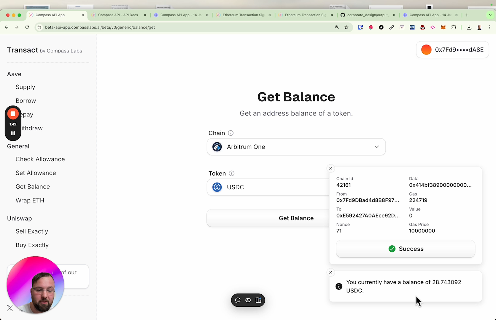
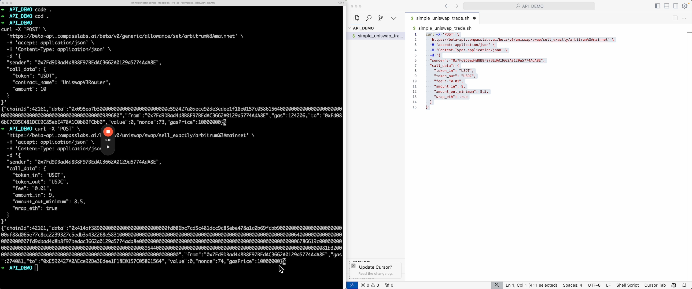
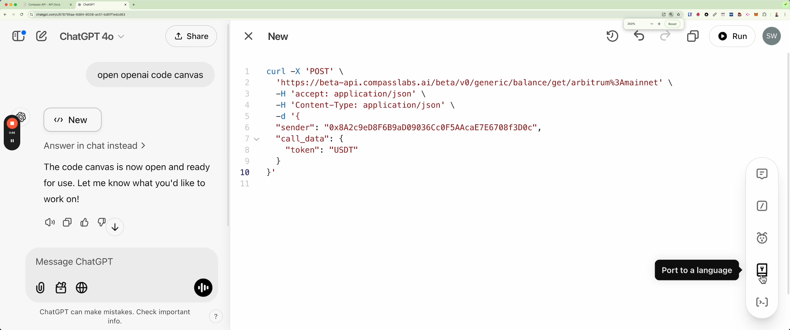

# Developer Quick Start
This repo contains 3 simple python scripts to help get you started with the Compass API in under 15 minutes, please see the video below for a walkthrough.

1. `quick_start.py` is a simple python script that works out of the box with one dependency (requests). It doesn't require any API keys or wallets. It be run with the following command:

```bash
pip install requests
python quick_start.py
```

2. `set_allowance_for_uniswap_trade.py` is a python script that sets an allowance for a Uniswap V3 trade.


3. `set_allowance_and_trade_on_uniswap.py` is a python script that sets an allowance for a Uniswap V3 trade and then performs a trade.


# Compass API Quick Start Guide
[](https://youtu.be/UPU787h59LY?si=bBC3j4TN85vZDKTt)


# COMPASS API LINKS:

- https://beta-api.compasslabs.ai/   the API docs
- https://beta-api-app.compasslabs.ai/   the API GUI
- https://compasslabs.github.io/dojo_api/   our site where you can sign transactions with your wallet


## Prerequisites for scripts 2 and 3:

You will need:
- a metamask wallet with some USDT on Arbitrum Mainnet.
- an RPC URL for the Arbitrum Mainnet (you can get one free from Infura.io).
- a private key (which you can get from your metamask wallet).

## Install Dependencies

```bash
pip install requests
pip install web3
pip install python-dotenv
```

## Run the scripts

```bash
python set_allowance_for_uniswap_trade.py
```

```bash
python set_allowance_and_trade_on_uniswap.py
```


# How to use the Compass API GUI:

[](https://youtu.be/mCuz8XNASfA)

# How to use the Compass API with cURL:

[](https://youtu.be/wbSM5Sf-_vo)

- https://beta-api-app.compasslabs.ai/   the API GUI
- https://compasslabs.github.io/dojo_api/   our site where you can sign transactions with your wallet

# How to convert between cURL and Python:

[](https://youtu.be/ULSQgITqrNc)


