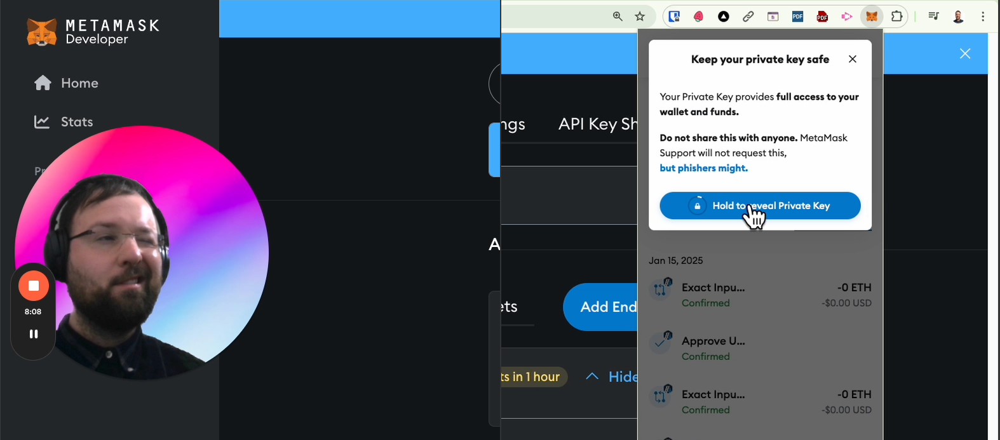

# Developer Quick Start
This repo contains 3 simple python scripts to help get you started with the Compass API in under 15 minutes, please see the video below for a walkthrough.

1. `quick_start.py` is a simple python script that works out of the box with one dependency (requests). It doesn't require any API keys or wallets. It be run with the following command:

```bash
pip install requests
python quick_start.py
```

2. `set_allowance_for_uniswap_trade.py` is a python script that sets an allowance for a Uniswap V3 trade.


3. `set_allowance_and_trade_on_uniswap.py` is a python script that sets an allowance for a Uniswap V3 trade and then performs a trade.


# Compass API Quick Start Guide
[](https://www.loom.com/embed/617aa0c12f0f4e988d32d84cd7f0c417?sid=01fcdf2e-62cf-476b-adb4-c320f30fdc2a)


## Prerequisites for scripts 2 and 3:

You will need:
- a metamask wallet with some USDT on Arbitrum Mainnet.
- an RPC URL for the Arbitrum Mainnet (you can get one free from Infura.io).
- a private key (which you can get from your metamask wallet).

## Install Dependencies

```bash
pip install requests
pip install web3
pip install python-dotenv
```

## Run the scripts

```bash
python set_allowance_for_uniswap_trade.py
```

```bash
python set_allowance_and_trade_on_uniswap.py
```


